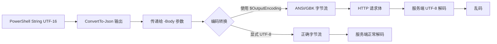

## 背景
在 OpenClaw 这样的 Agent 自动化体系里，我们经常需要让 Windows 主机通过脚本或 MCP 工具调用下游 REST API。一个非常典型的场景是：Agent 生成了一段中文摘要，PowerShell 用 `Invoke-RestMethod` 把它 POST 到某内部服务，结果对方收到的 JSON 里原本完好的中文字符变成了 `ç´¢å¼` 或者一堆问号。更隐晦的情况是，本地看起来打印正确的字符串，一旦通过管道或者 `Out-File` 落地成 .json 再被读取，就已经悄悄损坏。

这不是单个工具的 Bug，而是 Windows 平台上 PowerShell 与 .NET 运行时、控制台编码体系长期不一致的集中体现。如果你正在把 Agent 编排进 Windows 生态，这个问题迟早会撞上。

## 问题本质
PowerShell 在 Windows 上处理字符串时，底层是 .NET 的 UTF-16（`System.String`），这本身不会丢失中文。但一旦字符串需要离开进程边界——比如写入文件、通过 HTTP 发出、重定向到其他命令，就会触发一次编码转换。麻烦就在于 PowerShell 5.1 默认的转换目标编码是系统的当前 ANSI 代码页，通常是 `Windows-1252`（西欧语言）或 `GBK`（简体中文系统）。而大多数现代 API 都要求 UTF-8。

更具体地，以下环节会主动参与“打坏”中文：
- `Invoke-RestMethod` / `Invoke-WebRequest` 在发送请求体时，如果不显式指定 charset，会使用 `$OutputEncoding` 所对应的编码对字符串进行编码。默认的 `$OutputEncoding` 在 Windows PowerShell 里是 ASCII 兼容的代码页，并不保证支持全 Unicode。
- `ConvertTo-Json` 输出的 JSON 字符串本身没有问题，但它输出的是 `System.String`。该字符串被传递给请求的 `-Body` 参数时，PowerShell 会按 `$OutputEncoding` 重新编码，这才出乱子。
- `Out-File -FilePath data.json` 或重定向 `>` 同样会使用 `$OutputEncoding`，除非你显式指定 `-Encoding utf8`。

一个典型的“看起来正常”的陷阱：你在控制台打印 `$jsonBody`，中文字符显示正常。这是因为控制台主机在显示时又做了一次解码，恰好把原本的 ANSI 字节流“恢复”成了可视字符。但传给 API 的字节流已经是错的。

## 复现步骤
在中文 Windows 10 的 Windows PowerShell 5.1 中执行以下步骤，可以稳定复现问题：
1. 使用 `ConvertTo-Json` 构建含有中文的请求体：
   ```powershell
   $bodyObj = @{ title = "每日报告"; summary = "系统运行正常" }
   $jsonBody = $bodyObj | ConvertTo-Json -Compress
   ```
2. 模拟 API 调用（实际不请求，只检查 HTTP 层会发出的内容）：
   ```powershell
   $OutputEncoding  # 默认可能是 System.Text.SBCSCodePageEncoding
   Invoke-RestMethod -Uri http://localhost:8000/dump -Method Post -Body $jsonBody -ContentType "application/json"
   ```
3. 在接收端捕获原始字节，会发现中文被编码为 GBK 字节而非 UTF-8。如果接收端强约束为 UTF-8，就会解码成乱码。

为了快速验证，你也可以直接把字节写到文件：
```powershell
[System.IO.File]::WriteAllBytes("$pwd\raw.txt", [System.Text.Encoding]::Default.GetBytes($jsonBody))
```
然后用 UTF-8 查看器打开，乱码即刻暴露。

## 根因链路图


## 可靠修复
**方案一（推荐）：全局锁定输出编码**
在脚本最开头设置，一次性解决大部分隐式转换问题：
```powershell
$OutputEncoding = [System.Text.Encoding]::UTF8
[Console]::OutputEncoding = [System.Text.Encoding]::UTF8
```
`$OutputEncoding` 负责管道和 HTTP 正文的编码；`[Console]::OutputEncoding` 则影响控制台输出，确保调试打印不乱码。这对 `Invoke-RestMethod` 的字符串 Body 直接有效。

**方案二：显式指定 Content-Type 的 charset**
`-ContentType "application/json; charset=utf-8"` 可以增强可读性，但在 Windows PowerShell 中光这样做不够，因为它并不强制覆盖 Body 编码。搭配方案一才稳妥。

**方案三：使用字节数组作为 Body**
放弃字符串传递，直接把 JSON 按 UTF-8 编码为字节流：
```powershell
$utf8Bytes = [System.Text.Encoding]::UTF8.GetBytes($jsonBody)
Invoke-RestMethod -Uri ... -Body $utf8Bytes -ContentType "application/json"
```
这跳过了全部隐式转换，是最可靠、最跨版本的方式，适合封装成通用工具函数。

**方案四：使用 PowerShell 7+**
PowerShell 7（pwsh.exe）默认以 UTF-8 无 BOM 处理所有文本，`$OutputEncoding` 默认就是 `UTF8Encoding`，不需要额外配置。如果环境可以迁移，这是根本解法。

## 踩坑点
1. **`-ContentType "application/json; charset=utf-8"` 单用无效**  
   这仅设置 HTTP 头，PowerShell 5.1 不会因此改变 Body 的实际编码，务必检查 `$OutputEncoding`。
2. **“看起来正确”的假象**  
   不要依赖控制台显示验证是否乱码，控制台可能用同一种错误编码“反向还原”出正确字符。用文件 `[System.IO.File]::WriteAllBytes` 保存后，用十六进制编辑器或 `xxd` 检查字节才是可靠的。
3. **`ConvertTo-Json` 深度不够**  
   默认仅序列化深度 2。深层结构会被截断。务必加 `-Depth 10` 或更大值，尤其是在嵌套复杂对象时。
4. **BOM 问题**  
   若 API 端对 BOM 敏感，用 `New-Object System.Text.UTF8Encoding($false)` 生成无 BOM 的 UTF-8 来替换 `[System.Text.Encoding]::UTF8`。
5. **重定向 `>` 永远是陷阱**  
   在 Windows PowerShell 中，`> file` 等价于 `Out-File`，默认编码是 Unicode（UTF-16 LE）而非 UTF-8！当你用 `Get-Content` 读取时可能又自动转换，导致内容与预期完全不同。永远显式使用 `Out-File -Encoding utf8` 或 `Set-Content -Encoding utf8`。

## 可复用建议
- 在 Windows 上运行任何 Agent 调用的脚本模板，开头固定三行：
  ```powershell
  $OutputEncoding = [System.Text.Encoding]::UTF8
  [Console]::OutputEncoding = [System.Text.Encoding]::UTF8
  $PSDefaultParameterValues['*:Encoding'] = 'utf8'
  ```
  这会覆盖大部分命令的隐式编码行为。
- 将 HTTP API 调用封装成函数，内部统一使用字节数组 Body，避免业务代码接触编码细节。
- 在 CI Pipeline 里加入简单的编码检测：对候选 JSON 文件执行 `file --mime-encoding`，若输出不是 `utf-8` 则中断构建。
- 强烈建议将 Windows 脚本执行环境升级到 PowerShell 7，并将系统区域设置（Beta 选项）的“使用 Unicode UTF-8 提供全球语言支持”打开，从而在系统层面减少编码摩擦。

## 总结
Windows 中文 JSON API 调用的乱码，本质是 PowerShell 5.1 默认输出编码与 UTF-8 现代化要求之间的冲突。它不是中文字符本身的问题，而是字符串离开进程时使用 ANSI 页面编码造成的字节级损坏。修复方案并不复杂：要么锁定 `$OutputEncoding`，要么用字节流绕过，要么直接转用 PowerShell 7。关键在于别被控制台的“视觉正确”欺骗，始终用字节验证。在 OpenClaw 这类强调自动化、链式工具的社区里，这种编码基础层面的健壮性，正是决定 Agent 是否“稳定可交付”的重要细节。

---

## 配图


