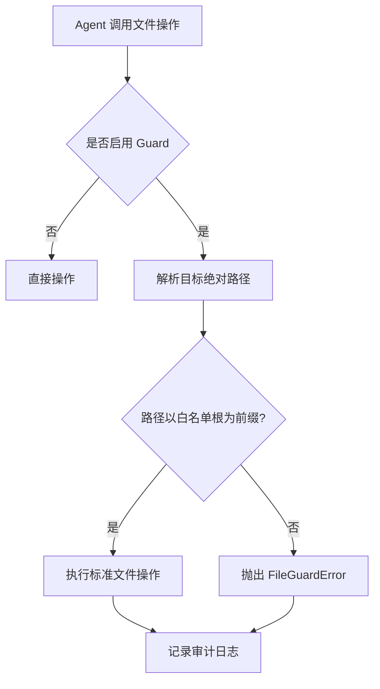

## 背景：当 Agent 的手伸向本地文件

OpenClaw 等 Agent 框架让模型调用本地脚本、读写文件变得非常容易。一个典型的自动化链路上，Agent 要处理本地 Markdown、导出数据、生成报告，这些操作都绕不开文件系统。能力越大，责任越大，问题也随之而来：如果模型产生幻觉，或者 prompt 被注入，你的 `rm -rf` 或者 `shutil.rmtree` 会删到哪里？

很多工程师的做法是把整个项目目录「喂」给 Agent，甚至图方便直接给容器内 root 权限。这种宽松策略在原型阶段看似无伤大雅，一旦脚本进入日常 cron 或分享给他人，风险指数会飙升。给文件访问加一道目录白名单护栏，不是过度防御，而是自动化脚本安全的基本功。

## 问题拆解：你真正想限制的是什么？

目标很清晰：Agent 只能读写预先指定的目录树，对范围外的任何路径，操作都应被拦截。看似简单，但工程实现上会遇到几个典型问题：

- **相对路径**：Agent 脚本可能在运行时改变工作目录，`open('../secret.env')` 就能跳出预期范围。
- **符号链接**：即使允许的目录是 `/project/data`，软链接指向 `/etc/passwd` 也能实现逃逸。
- **库函数发散**：你封住了 `open()`，第三方库可能绕过调用 `os.open()` 或更底层的系统调用。
- **临时目录与缓存**：许多库会写 `/tmp`，如果完全禁止又会破坏功能。

一个务实的护栏方案，需要在易用性与安全性之间找到平衡点：轻量、无外部依赖、对现有代码侵入性小，同时能兜住常见攻击面。

## 常规手段的局限

完全隔离的方案，比如 Docker 或 Firejail，重且不适合本地轻量脚本场景。`chroot` 需要 root 权限，且配置繁琐。语言级沙箱（如 Python 的 `RestrictedPython`）则阉割了太多语言特性，几乎不可行。

我们需要的是一个**路径解析层的拦截器**，它能对每一次文件访问请求做规范化路径检查，只放行落在白名单子树内的操作。

## 实现：一个可复用的 Python 文件操作护栏

以下实现基于 Python，因为 Agent 生态中 Python 工具调用占据主流。

### 核心思路

1. 定义白名单根目录列表（支持多个）。
2. 拦截所有路径参数，使用 `os.path.realpath()` 解析符号链接并返回绝对路径。
3. 检查解析后的路径是否以白名单根目录为前缀。注意处理路径分隔符，防止 `/data_tmp` 匹配到 `/data` 前缀。
4. 通过自定义的 `open()`、`os.remove()` 等替换内置函数，在 Agent 执行的上下文里只暴露安全版本。

### 代码骨架

```python
import os
import builtins
from pathlib import Path
from functools import wraps
from typing import List, Union

class FileGuardError(PermissionError):
    pass

class FileGuard:
    def __init__(self, allowed_roots: List[Union[str, Path]]):
        self.allowed_roots = [Path(r).resolve() for r in allowed_roots]

    def _check(self, path: Union[str, Path]) -> Path:
        target = Path(path).resolve()
        # 检查是否在任一允许的目录树下
        if not any(
            root == target or root in target.parents
            for root in self.allowed_roots
        ):
            raise FileGuardError(f"Access denied: {target}")
        return target

    def safe_open(self, file, mode='r', *args, **kwargs):
        file = self._check(file)
        return open(file, mode, *args, **kwargs)

    def safe_remove(self, path):
        path = self._check(path)
        os.remove(path)

    # 可按需扩展 os.rename, shutil.rmtree 等
```

在实际使用中，我们不需要立刻覆盖全部函数，而是针对 Agent 直接调用的接口——通常是 `open` 和 `os.remove` 等，将它们注入到工具函数的全局命名空间。例如：

```python
from module_guard import FileGuard

guard = FileGuard(allowed_roots=["/project/workspace", "/tmp/agent_sandbox"])

def agent_write_file(filename, content):
    with guard.safe_open(filename, 'w') as f:
        f.write(content)

def agent_delete_file(filename):
    guard.safe_remove(filename)
```

这样，Agent 只能在这两个目录树内操作。

## 踩坑记录

实际部署中，几个细节会让人头疼：

### 1. 多进程与临时目录

如果 Agent 调用了 `tempfile` 模块，默认会在 `/tmp` 下创建文件。若 `/tmp` 不在白名单中，操作会失败。解决方式有两种：要么将 `/tmp/agent_sandbox` 这样的专用目录加入白名单，要么通过环境变量 `TMPDIR` 将临时目录重定向到白名单内。

### 2. 符号链接逃逸

`Path.resolve()` 会跟随符号链接，能有效阻挡直接指向白名单外的软链接。但如果白名单目录内有一个指向 `../` 的硬链接呢？硬链接不改变路径解析，`resolve()` 后路径依然在子目录内，但实际操作可能指向外部文件。因此，对于**高安全需求场景**，应禁止已有敏感内容的目录挂载，或使用 `os.lstat` 检测硬链接 inode 重复（代价较高）。绝大多数自动化场景下，白名单目录是 Agent 专用沙箱，不会引入恶意链接。

### 3. 路径规范化差异

Windows 与 macOS/Linux 的路劲处理差异是个经典问题。`Path.resolve()` 在跨平台表现基本一致，但要注意盘符和用户主目录快捷方式。如果你的 Agent 脚本需要在不同系统上运行，统一使用 `pathlib` 并避免直接用字符串拼接路径。

### 4. 第三方库的「后门」

你无法拦截所有底层系统调用。如果有被信任的库内部执行 `os.system('rm /important')`，护栏会失效。一个折中是限制 Agent 只能调用你封装的工具函数，将第三方库调用也放在受控的上下文中。

## 可复用建议

如果你在 OpenClaw 生态中构建 Agent，可以将这个护栏做成一个可选中间件：

- **封装为 Tool 装饰器**：所有文件类 tool 声明时，自动用 `FileGuard` 做参数校验。
- **配置化白名单**：通过 `openclaw.tools.settings` 注入允许目录，动态生效。
- **审计日志**：每次拦截除了抛异常，还记录文件路径、时间戳、调用的 tool 名称，便于事后排查。
- **与 MCP 集成**：如果你使用 MCP 服务器调用本地文件系统，也可以在 MCP tool 端加上同样逻辑。

一个更健壮的开源实践是：将 `FileGuard` 作为独立 pip 包维护，配合 `unittest.mock` 风格的沙盒模式，在 CI 中测试 Agent 的行为边界。

## 总结

本地目录白名单不是银弹，但它能以极低的成本避免 80% 的灾难性误删。工程化的护栏应该像代码规范一样，成为自动化脚本的默认配置，而不是出事后的补丁。当你的 Agent 开始在凌晨两点自动执行文件操作时，你会庆幸当初多写了那几行路径检查。

**附：护栏决策流程图**


---

## 配图


